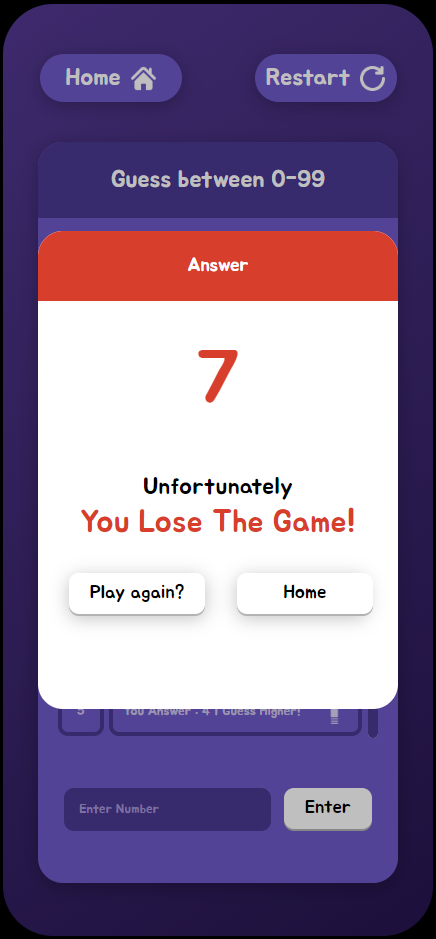

# React + Vite

This template provides a minimal setup to get React working in Vite with HMR and some ESLint rules.

Currently, two official plugins are available:

- [@vitejs/plugin-react](https://github.com/vitejs/vite-plugin-react/blob/main/packages/plugin-react/README.md) uses [Babel](https://babeljs.io/) for Fast Refresh
- [@vitejs/plugin-react-swc](https://github.com/vitejs/vite-plugin-react-swc) uses [SWC](https://swc.rs/) for Fast Refresh
 
 

<h1> Ten Answer Game </h1>
<b> Developer : </b> Pitchaya hutajuta, 
Piyakrit Wongkasamesak, Kittipat Pramjit  

<b> Preview : </b> 

  
  
  

  

Try this game: [https://lightz1890.github.io/TenAnswers/](https://lightz1890.github.io/TenAnswers/)
